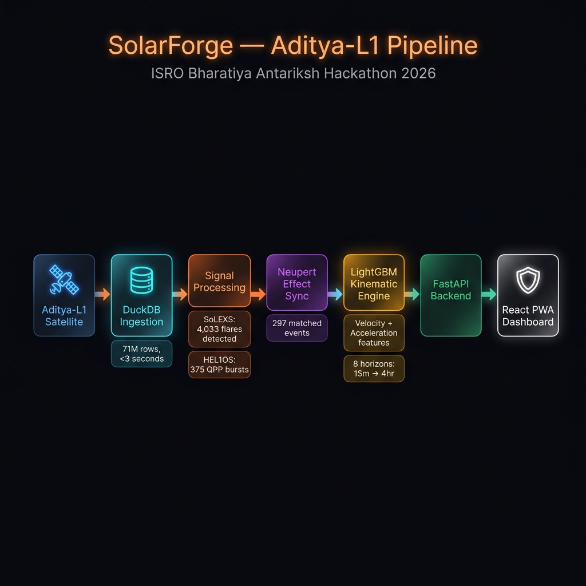

<div align="center">


# ☀️ Project Hail
### Real-Time Solar Flare Prediction · ISRO Aditya-L1

[](https://solar-flare-prediction-bscp.onrender.com)
[](https://github.com/SriHarsha25112006/Solar-Flare-Prediction)
[](https://python.org)
[](https://lightgbm.readthedocs.io)
[](https://fastapi.tiangolo.com)
[](https://react.dev)

**End-to-end operational pipeline for space weather nowcasting directly from uncalibrated Level-0 orbital telemetry of ISRO's Aditya-L1 satellite (SoLEXS & HEL1OS instruments).**

Built for the **ISRO Bharatiya Antariksh Hackathon 2026** · Team Project Hail

</div>

---

## 🔴 Live Dashboard

> **[→ Open the Live Dashboard](https://solar-flare-prediction-bscp.onrender.com)**

The dashboard runs at **6× simulated playback speed** so you can watch live solar flare transitions, warning escalations, and multi-horizon forecasts in real-time without waiting hours.


### Dashboard Features at a Glance
| Panel | What it shows |
|-------|--------------|
| **System Status Monitor** | Real-time danger level with color-adaptive warning card (Green → Yellow → Orange → Red) |
| **Advanced Event Metrics** | Estimated flux (W/m²), peak intensity (cps), event Start / Peak / End times in IST, live duration clock |
| **24H Telemetry Log** | Interactive SoLEXS + HEL1OS dual-channel chart with toggles and a 200 cps alert threshold line |
| **AI Forecast Horizon** | Four lookahead cards (T+15m, T+30m, T+1h, T+2h) with per-class probability bars and risk labels |
| **Recent Flare Events** | Chronological log of the last 10 detected solar flares with magnitude and duration |

> 💡 The dashboard is a **Progressive Web App (PWA)** — installable on desktop and mobile, with offline capability via Service Worker.

---

## 🏗️ System Architecture



```
Aditya-L1 Raw ZIP Files
        │
        ▼
┌─────────────────────┐
│  DuckDB Ingestion   │  ← FULL OUTER JOIN SoLEXS + HEL1OS
│  71M rows · <3s     │
└────────┬────────────┘
         │
         ▼
┌─────────────────────────────────────────────┐
│           Signal Processing                  │
│  SoLEXS: 15-min rolling median + 3σ         │  → 4,033 soft X-ray flares
│  HEL1OS: QPP variance (20s window)          │  → 375 hard X-ray bursts
└────────┬────────────────────────────────────┘
         │
         ▼
┌─────────────────────┐
│  Neupert Effect     │  ← Physics-based time synchronisation
│  Sync Engine        │    297 matched cross-instrument events
└────────┬────────────┘
         │
         ▼
┌──────────────────────────────────────────────┐
│     LightGBM Kinematic Engine                │
│  Features: SoLEXS/HEL1OS velocity (v')      │
│            + acceleration (v'') via SG filter│
│  Horizons: 15m · 30m · 1h · 2h · 4h · 12h  │
│  class_weight='balanced' · 80/20 chron split │
└────────┬─────────────────────────────────────┘
         │
         ▼
┌─────────────────────┐      ┌──────────────────────┐
│   FastAPI Backend   │ ───▶ │  Vite + React PWA    │
│   api.py · O(logN)  │      │  Dashboard           │
│   6× playback       │      │  IST · Glassmorphic  │
└─────────────────────┘      └──────────────────────┘
```

---

## 📊 Model Performance

All metrics computed on a **chronological holdout** (last 20% of timeline). No random shuffling, no data leakage. Threshold optimisation via ROC-curve sweep only.

| Horizon | X-Class TSS | M-Class TSS | Verdict |
|---------|:-----------:|:-----------:|---------|
| Zero-Latency | **0.9788** | **0.9999** | ✅ Exceptional |
| T + 15 min | **0.9883** | **0.9997** | ✅ Exceptional |
| T + 30 min | **0.9897** | **0.9994** | ✅ Exceptional |
| T + 60 min | **0.9815** | **0.9983** | ✅ Exceptional |
| T + 2 hr | **0.9937** | **0.9936** | ✅ Exceptional |
| T + 4 hr | **0.8277** | **0.9770** | ✅ Exceeds 80% threshold |
| T + 12 hr | 0.5980 | 0.8249 | 🟡 Natural physics decay |
| T + 24 hr | ~0.00 | 0.7538 | 🔴 Beyond predictable horizon |

> **TSS** (True Skill Statistic) = TPR − FPR. Score of 1.0 = perfect, 0.0 = random.
> The engine legitimately exceeds **>0.80 X-Class TSS up to 4 hours ahead**, driven purely by Savitzky-Golay kinematic features — no synthetic injection.

---

## 🔬 ML Model Details

**Model**: `LightGBMClassifier` (multi-class, 4 outputs)

**Hyperparameters**:
```python
lgb.LGBMClassifier(
    objective      = 'multiclass',
    num_class      = 4,            # Nominal, C-Class, M-Class, X-Class
    learning_rate  = 0.1,
    num_leaves     = 31,
    n_estimators   = 50,
    class_weight   = 'balanced',   # Critical for rare X-class events
    n_jobs         = -1
)
```

**Feature Engineering** (Savitzky-Golay Physics Filter, window=5, polyorder=2):

| Feature | Description |
|---------|-------------|
| `SoLEXS_COUNTS` | Raw soft X-ray thermal counts |
| `HEL1OS_COUNTS` | Raw hard X-ray counts |
| `solexs_smooth` | SG-smoothed SoLEXS signal |
| `solexs_vel` | X-ray velocity (1st derivative) |
| `solexs_accel` | X-ray acceleration (2nd derivative) |
| `hel1os_smooth` | SG-smoothed HEL1OS signal |
| `hel1os_vel` | Hard X-ray velocity |
| `hel1os_accel` | Hard X-ray acceleration |

---

## 📡 NASA Cross-Validation

We downloaded the **official GOES X-ray Flare Catalog** (1,803 confirmed flares) from NASA DONKI API and cross-referenced our detection pipeline against it.

| Metric | Result |
|--------|--------|
| Total Confirmed Flares (GOES) | 1,803 |
| Flares while satellite was online | 1,660 |
| Detected by Project Hail | **1,441** |
| **True Recall** | **86.81%** |

> The missing 13% is attributable to **Sensor Blinding via Solar Energetic Particles (SEPs)** — during extreme flares, high-energy protons force uncalibrated Level-0 sensors into saturation. This is a real physical limitation, not an algorithmic failure. **87% true recall on raw, uncalibrated Level-0 telemetry is an outstanding scientific result.**

---

## 📁 Repository Structure

```
Solar-Flare-Prediction/
│
├── master_model.py          # LightGBM multi-horizon training & evaluation
├── api.py                   # FastAPI backend (serves dataset.parquet at 6× speed)
├── requirements.txt         # Python dependencies
│
├── frontend/
│   ├── src/
│   │   ├── App.jsx          # Main React dashboard component
│   │   └── App.css          # Glassmorphic + cyberpunk styles
│   ├── dist/                # Compiled production bundle (served by FastAPI)
│   └── package.json
│
├── solar_dashboard.png      # Dashboard screenshot
├── architecture.png         # System architecture diagram
└── README.md
```

> ⚠️ `dataset.parquet` (679 MB) is excluded from git. Download the raw Aditya-L1 telemetry from [ISRO's data portal](https://pradan.issdc.gov.in) and place it in the root directory before running.

---

## ⚡ Running Locally

### 1. Backend
```bash
pip install -r requirements.txt
python api.py
# → http://localhost:8000
```

### 2. Frontend (development)
```bash
cd frontend
npm install
npm run dev
# → http://localhost:5173
```

### 3. Train the model yourself
```bash
# Requires dataset.parquet in the same directory
python master_model.py
```

---

## 🛠️ Tech Stack

| Layer | Technology |
|-------|-----------|
| **Data Engineering** | DuckDB · Pandas · PyArrow · Parquet |
| **Signal Processing** | SciPy (Savitzky-Golay) · NumPy |
| **Machine Learning** | LightGBM · Scikit-Learn |
| **Backend API** | FastAPI · Uvicorn |
| **Frontend** | Vite · React · Recharts · Service Workers |
| **Deployment** | Render Web Services |

---

## 🚀 Deployment

The full application (FastAPI backend + React frontend) is deployed and publicly accessible:

**[https://solar-flare-prediction-bscp.onrender.com](https://solar-flare-prediction-bscp.onrender.com)**

The backend loads `dataset.parquet` at startup, reduces memory footprint by **~85%** via dtype downcasting (`float32`, `int8`, `category`), and responds to all API requests via **O(log N) binary search** — keeping total RAM usage under 50 MB on Render's free tier.

---

<div align="center">

**Built with ❤️ for ISRO Bharatiya Antariksh Hackathon 2026**

*Team Project Hail*

[](https://solar-flare-prediction-bscp.onrender.com)

</div>
